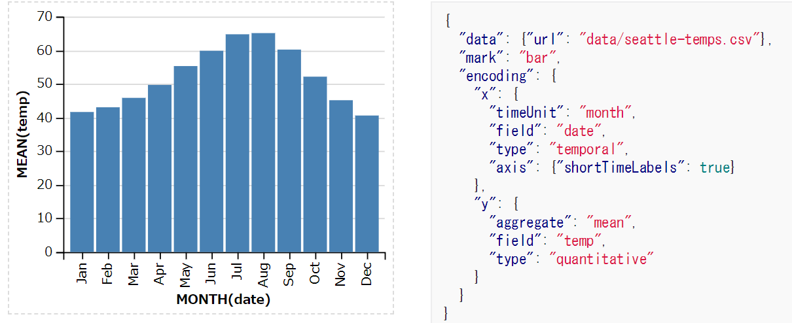

title: 論文執筆環境(LaTeX, overleaf, github 等)

# 概要

現在使っている論文執筆環境のメモです．随時更新予定．
ご指摘，ご意見など大歓迎です!
便利なツールなどあればぜひ教えてください！

# ツール

## [Overleaf](https://www.overleaf.com/)

- オンライン latex 執筆環境
- latex の環境構築を一切することなく，編集から pdf 出力までブラウザ上で完結
  - vim, emacs mode あり
- GitHub との直接連携

ローカルで編集するほうがいろいろと都合がいいこともあるが，環境構築なし・ブラウザ完結はその欠点を補って余りあるメリットだと思います．

### ※GitHub との連携

- overleaf は ver1, ver2 があり，現在どちらも使用可能
- ver2 では直接 GitHub と連携可能
- ver1 では git remote repository として利用可能だが，直接 GitHub との連携はできない
  - つまり手動で GitHub と sync する必要がある
  - ver2 は git remote repository として利用できない - そのうち ver2 でもできるようになるらしい([ref](https://www.overleaf.com/help/343-working-offline-in-overleaf-v2#.W55MsOj7TD4)

    特にこだわりがないのなら ver2 + GitHub がおすすめです．

## GitHub

- バージョン管理，バックアップ等のため利用
- 月 700 円程度の課金で private repository も作れるので，公開したくない場合はそれを利用すると良い

  Overleaf との連携のほか，Dropbox に local repository を作って作業しています．
  つまりあまり意識せずとも 3 箇所で全ファイルが保存されているので，バックアップの手間はありません．

## Dropbox

- local repository の置き場

僕は Windows ユーザなのですが，bash on ubuntu on windows で直接操作できます．

## matplotlib (+seaborn), Jupyter, Inkscape

グラフ作成のためのツールたちです．
以下の流れで使ってます．

1. plot 用の csv ファイルを用意
1. Jupyter 上で matplotlib を使って **svg** ファイルとして保存
1. Inkscape を使ってちょっと修正
1. **pdf**形式で保存

- matplotlib + seaborn

  - python パッケージ
  - [seaborn](https://seaborn.pydata.org/index.html)を使うことで見た目が綺麗になるので必須

- [Jupyter](https://jupyterlab.readthedocs.io/en/stable/index.html)

  - 細々とした処理を log として残しておくために使用
  - 図の修正をするときに非常に便利

- Inkscape
  - matplotlib で作成したグラフを微修正するために使用
  - svg ファイルを編集
  - latex 用に pdf ファイルを保存．（なぜ pdf かは[ここ](https://en.wikibooks.org/wiki/LaTeX/Labels_and_Cross-referencing)などを参照)
  - layer を使って保存すると再利用性が高く，修正が非常に楽
    - tar 形式で各 layer を別々に保存可能

# その他便利ツールなど

## [Vega-Lite](https://vega.github.io/vega-lite-v1/)

- json にグラフを書くために必要な情報をすべて保存できる
  - データや設定など
  - つまりグラフ修正のたびにコードを回す必要はない
- python で利用するには altair(https://altair-viz.github.io/)が便利
  - pandas dataframe をそのまま渡せる
- [オンラインエディタ](https://seaborn.pydata.org/index.html)あり

matplotlib の代替として使ってみたのですが，白黒グラフを作るのがちょっと辛かったので今は使っていません．

